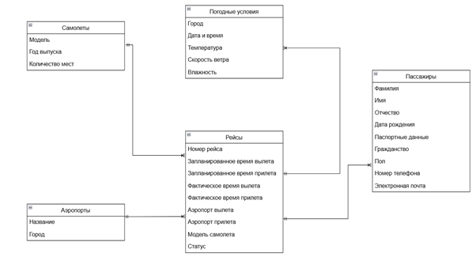
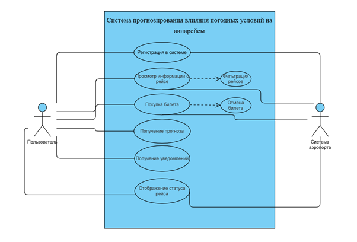

# Аналитические артефакты и описание проекта

## 1) Основные объекты продукта

### 1. Погодные данные

- **Исходящие данные о текущих погодных условиях**
- **Прогнозы погоды**
- **Исторические данные о погоде в регионах вылета и прилета**

### 2. Системы обработки данных

- **Модули для сбора и обработки погодной информации**
- **Алгоритмы машинного обучения для анализа и предсказания**
- **Базы данных для хранения информации о рейсах и погоде**

### 3. Аналитические модули

- **Адаптивные модели**, учитывающие местные погодные особенности

### 4. Интерфейсы

- **API** для интеграции с существующими системами рейсов
- **Интерфейс** для пользователей, предоставляющий информацию о статусе рейсов

### 5. Алгоритмы прогнозирования

- **Модели предсказания** вероятности отмены или переноса рейсов
- **Статистические методы** и методы машинного обучения для анализа корреляций между погодой и рейсами

### 6. Прогнозы и рекомендации

- **Система рекомендаций** для операторов по изменению расписания
- **Напоминания** о возможных изменениях рейсов на основе погодных условий

### Сущности и атрибуты

#### 1. Рейс
- Номер рейса
- Запланированное время вылета
- Запланированное время прилета
- Фактическое время вылета
- Фактическое время прилета
- Аэропорт вылета
- Аэропорт назначения
- Модель самолета
- Статус

#### 2. Погодные условия
- Город
- Дата и время
- Температура
- Скорость ветра
- Влажность

#### 3. Аэропорт
- Название
- Город

#### 4. Самолет
- Модель
- Год выпуска
- Количество мест

#### 5. Пассажир
- Фамилия
- Имя
- Отчество
- Дата рождения
- Паспортные данные
- Гражданство
- Пол
- Номер телефона
- Электронная почта

### ER-диаграмма

   

### Операции в рамках проекта

1. **Сбор данных**
2. **Обработка данных**
3. **Анализ данных**
4. **Прогнозирование**
5. **Выдача рекомендаций**
6. **Мониторинг**
7. **Обновление алгоритмов**

## 2) Ролевая модель

### Наши пользователи

#### Пассажиры
- Люди, которые приобретают билеты на рейсы S7 Airlines и используют рекомендации нашей системы.

#### Администраторы
- Сотрудники, отвечающие за управление рейсами, их расписанием и реагированием на изменения погоды.

### Функции пользователей в системе

#### Пассажиры:
- **Приобретение билетов**  
  Покупают билет на самолет.
  
- **Использование системы**  
  Пользуются нашей системой для получения информации о рейсах.

- **Просмотр прогнозов**  
  Видят прогнозы переноса и отмены рейсов.

#### Администраторы:
- **Мониторинг состояния рейсов**  
  Контролируют состояние рейсов в реальном времени.

- **Принятие решений**  
  Принимают решения на основе данных о погоде и предсказаниях системы.

- **Реагирование на изменения**  
  Обеспечивают быстрое реагирование на изменения в расписании рейсов.

### Определение пользователя и его ограничения

#### Аутентификация
- Пассажиры и администраторы могут входить в систему с помощью своих учетных данных.

#### Роль и доступ
- В зависимости от роли (пассажир, администратор) система предоставляет разные уровни доступа к информации и функциям.

#### Ограничения
- **Пассажиры**  
  Пассажиры могут видеть только информацию, касающуюся их рейсов.

- **Пользователи**  
  Все пользователи могут иметь ограниченный доступ к функциям системы в зависимости от уровня их авторизации.

- **Администраторы**  
  Администраторы могут иметь ограниченный доступ к данным, если они не касаются их конкретных задач.

### Процесс назначения ролей

#### Регистрация
- При регистрации пользователь указывает свою роль (пассажир или администратор), что фиксируется в системе.

#### Управление ролями
- Администраторы системы могут настраивать доступ и назначения ролей, основываясь на обязанностях и потребностях пользователей.

#### Идентификация через учетные записи
- Каждому пользователю присваивается уникальная учетная запись, которая связывается с конкретной ролью, что позволяет управлять доступом и функциями в системе.

## 3) Пользовательские/Функциональные/Нефункциональные требования

### Пользовательские требования

1. **Регистрация**  
   Пользователь должен иметь возможность зарегистрироваться в системе.

2. **Просмотр информации о рейсах**  
   Система должна позволять пользователю просматривать информацию о рейсах, включая запланированное и фактическое время вылета и прилета.

3. **Фильтрация рейсов**  
   Пользователь должен иметь возможность фильтровать рейсы по аэропорту вылета, аэропорту назначения и дате.

4. **Покупка билетов**  
   Система должна предоставлять возможность пользователю купить билет на нужный ему рейс.

5. **Прогноз переноса рейса**  
   Система должна предоставлять прогноз возможного переноса рейса на основе текущих погодных условий.

6. **Уведомления о переносе рейсов**  
   Пользователь должен иметь возможность получать уведомления о переносе рейсов на другое время.

7. **Актуальный статус рейса**  
   Система должна отображать актуальную информацию о статусе рейса (например, "задержан", "отменен", "по расписанию").

### Функциональные требования

1. **Хранение информации о рейсах**  
   Система должна хранить информацию о рейсах, включая:
   - Номер рейса
   - Запланированное и фактическое время вылета и прилета
   - Аэропорт вылета и назначения
   - Модель самолета
   - Статус рейса

2. **Автоматическое обновление статуса рейса**  
   Система должна автоматически обновлять статус рейса на основе данных из внешних источников (например, авиакомпаний).

3. **Расчет вероятности переноса рейса**  
   Система должна рассчитывать вероятность переноса рейса на основе текущих погодных условий в аэропортах вылета и назначения.

4. **Уведомления о переносе рейсов**  
   Система должна отправлять уведомления пользователям о переносе рейсов через электронную почту или SMS.

### Нефункциональные требования

- **Производительность**: Система должна обрабатывать запросы о статусе рейса за время не более 2 секунд.
- **Нагрузка**: Система должна поддерживать одновременную работу до 10 000 пользователей.
- **Надежность**: Система должна иметь время безотказной работы (uptime) не менее 99,9%. В случае сбоя система должна восстановить работоспособность в течение 5 минут.
- **Безопасность**: Система должна шифровать все передаваемые данные, включая информацию о рейсах и пользователях. Доступ к данным о рейсах должен быть ограничен на основе ролей (например, администратор, пользователь).
- **Масштабируемость**: Система должна поддерживать увеличение нагрузки в 2 раза без потери производительности.
- **Удобство использования**: Интерфейс системы должен быть интуитивно понятным, а время обучения новому пользователю не должно превышать 10 минут.
- **Совместимость**: Система должна поддерживать работу на всех современных браузерах (Chrome, Firefox, Safari, Edge).

### Пользовательские требования в виде диаграммы

   

   
## 4) Прототипы интерфейса

Концепт того как должен выглядеть прогноз в полноценной карточке билета. Пользователь сможет увидеть шанс переноса/отмены рейса при просмотре вкладки “Мои бронирования”.

   

Так выглядит интерфейс для взаимодействия с нашим сервисом. Он будет интегрироваться в билет, как показано на первой картинке, но в случае расширения функционала можно вынести сервис на отдельную страницу, доступную с главной страницы сайта по ссылке “Прогноз отмены/задержки рейса”.

   

### Основная экранная форма интерфейса приложения

#### Форма поиска рейса
Основные элементы формы:

- **Поля ввода**:
  - **Фамилия**: Для ввода фамилии пассажира.
  - **Номер билета или брони**: Поле для ввода уникального номера билета или номера брони.
  
- **Кнопка "Найти"**: Для отправки введенных данных и получения результатов по статусу рейса.
- **Отмена/задержка рейсов**: Пользователи могут отслеживать возможность отмены или задержки рейса. Для этого они вводят свою фамилию и номер билета или брони.

### Основной пользовательский сегмент
- **Пассажиры**: Пассажиры вводят свои данные (фамилию и номер билета) для проверки статуса рейсов. После нажатия на кнопку "Найти" система предоставляет информацию о возможной отмене или задержке рейса.

- **Работники авиакомпании**: Служба поддержки может использовать тот же интерфейс для доступа к информации о рейсах. Они могут проверять статусы с более узким фокусом, включая детали обслуживания.

## 5) Перспективы расширения системы

 В дальнейшем мы могли бы расширить количество факторов, которые будут учитываться при анализе, например: атмосферное давление, количество осадков, исторические данные о погоде и т.д. Также добавить большее количество функций в нашу систему, такие как: интеграцию в карты, мобильное приложение, прогнозирование загруженности, анализ качества полета, персональные рекомендации по выбору одежды для комфорта до и после полета.

